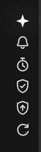

# Sidor_box · SIDOR 工具箱（独立附属插件）


DeepSeek Harness Web GUI 的 SIDOR 工具箱（独立分发仓库）。
与主皮肤 [Sidor_UI](../Sidor_UI) 是**互相独立的两个插件**——可单独安装，也可并存，
互不干扰（官方插槽 `settings.section` 按 `order` 自动排序共存）。

当前版本：**v1.0.4**（功能①–⑥完整；轨道左侧锚定，随左侧栏平滑跟随）。

## 效果预览

点击图片可查看完整尺寸。

| 设置页 · 工具箱 | 轨道图标 |
|---|---|
| [](preview/tool%20box.png) | [](preview/icon.png) |

## 功能

| # | 功能 | 说明 |
|---|---|---|
| ① | DeepSeek 峰谷价格提示 | 左侧轨道四芒星：高峰时段（北京时间 9:00-12:00、14:00-18:00）红色呼吸辉光，空闲时段白色闪耀呼吸辉光；每 30 秒自动刷新判定 |
| ② | Agent 任务完成提示 | Agent 完成回复时发送系统通知（跨网页提醒）；纯客户端 turnTail 检测，不消耗 token；未授权时改用界面 toast |
| ③ | Agent 任务进度查询（看门狗） | 监听任务是否卡住（运行中且 ≥10 秒无进展），两段倒计时：先浏览器提醒（不掐断、图标标红），再自动掐断 + 要求 Agent 自检；监听时长为 0 时插件不工作 |
| ④ | 审批通知提醒 | 工作区会话需要审批时，弹出系统通知并告知哪个对话需要处理（通知驻留直到处理）；界面审批卡探测 + Host 事件双通道 |
| ⑤ | 防崩溃守护 | 自动检测 DSH profile 路径并创建恢复存档；插件/环境变动前自动备份配置文件，滚动保留历史快照；生成 restore.cmd 一键回退脚本；双击轨道盾牌图标弹出二级确认界面直接备份；启动时环境安全检测，异常自动回退最近安全备份 |
| ⑥ | 插件与 DSH 版本检测 | 检测 DSH 客户端版本，并对用户安装的第三方插件（cordis.patch.yml 中非官方 @deepseek-ai 插件）查询最新版本：npm registry 优先；npm 未命中且有 GitHub 仓库（package.json `repository` 字段或手动绑定）时转查 GitHub releases/tags；可更新时右侧更新箭头图标标红；支持自动更新开关、手动绑定 GitHub 仓库与镜像基址 |

### 轨道位置（左侧锚定，随左侧栏平滑跟随）

轨道图标位于**左侧侧栏与工作区之间**、垂直居中，位置 = `左侧栏右缘 + 左距`（默认 12px，可在
设置页调整）。左侧栏展宽 / 收缩时轨道**平滑跟随**（`transition: left 0.24s`），不因悬浮、滚动、
右侧面板或滚动条显隐而变动：

- **左侧栏探测**：在贴左缘（`x = 4`）的 5 个高度做命中测试（`document.elementsFromPoint`），
  取「左缘 ≤ 4px、高度 ≥ 50% 视口、宽度 ≤ 28% 视口」中**最宽**的容器。
  宽度上限定窄是有意的：过宽会把"左侧栏 + 部分工作区"的外层包装容器误认为侧栏。
- **防抖（治闪烁）**：某一拍探测失败时**保留上次结果**（连续 6 拍失败才回落贴左缘）；
  新位置需**连续两拍一致**才写入（改设置时立即生效）；死区 4px；变更后连发重算
  （80/180/320/520ms），侧栏动画结束即落到最终位置。
- **新对话创建界面**：`ConversationRoot` 的 `data-phase="hero"` 时整体隐藏，
  `settling` / `active` 显示；判定采用取值白名单（输入框另有同名 `data-phase`，
  取值为 `plain`/`claimed`/`submitting`/`adjudicating`/`inert`，与三值不相交）。
- **实现**：0.9 秒轮询 + `resize` / `scroll` 节流 + `MutationObserver`
  （`data-phase` / `style` / `class` 变化）即时响应；核心几何属性带 `!important`，
  并在代码里写内联样式，压过可能残留的旧版规则。
- **诊断**：设置 → 工具箱 → **「探查左侧结构」**，输出轨道矩形与计算样式、左侧栏判定、
  以及左缘三个高度的叠层清单，并报告**页面 `.sid-rail` 元素个数**（应为 1，用于发现重复实例）。

## 安装

### 懒人版

把你的 dsh 打开，对它说：

```
安装一下这个工具箱插件：https://github.com/AKI2253/Sidor_box
```

> 说明：dsh 助手会 `git clone` / 读取该仓库并自动完成安装。

### 本地版（PowerShell，无需 GitHub）

```powershell
cd <Sidor_box 仓库路径>
powershell -ExecutionPolicy Bypass -File .\scripts\install.ps1            # 安装
powershell -ExecutionPolicy Bypass -File .\scripts\install.ps1 -Remove    # 卸载
```

### 命令版（需 pnpm）

```sh
cd <harness 目录>
dsh plugin --profile web add <Sidor_box 仓库路径>
```

安装 = 复制包到 `%USERPROFILE%\.dsh\profiles\web\node_modules\sidor-box`
+ 在 profile 的 `cordis.patch.yml` 追加 `- insert: {id: sidor-box, name: sidor-box}`。
安装后**重启 DSH**，浏览器 `Ctrl+Shift+R` 硬刷新。

> 若此前装过动态形态（sidb-* 会话内插件），安装静态版并重启 DSH 后，
> 动态插件随进程退出自动消失，不会冲突；静态版与动态版的设置（localStorage）
> 共用同一批 key，一次填写即可迁移。

## 静态形态说明

Sidor_box 为**静态持久化插件**（install.ps1 安装到 profile，随 DSH 启动自动加载），
**无 host RPC 通道**。依赖宿主的能力（看门狗 Host 事件、审批 Host 事件、防崩溃
文件操作、版本检测文件扫描）由客户端在检测到 `host.call` 不可用后**自动降级为
「agent 代执行」**——通过官方 `/api`（session.prompt queue，零 token）向 Agent
发出指令，由 Agent 读取文件/执行操作后汇报。版本检测的 npm/GitHub 查询由浏览器
`fetch` 直接完成（静态形态同样可用）。

## 开发

| 文件 | 说明 |
|---|---|
| `src/sidor-box-client.js` | Client 半源码（插件函数体，`return { inject: ['timer'], apply(ctx) }`） |
| `scripts/client-wrapper.template.js` | ModuleLoader bundle 模板（闭包注入 React / styles / host / harness；host.call 一律 reject 触发静态降级） |
| `scripts/build-client.ps1` | 构建：源码内联 → `lib/client.js`（含 `node --check` 语法门禁） |
| `scripts/install.ps1` | 安装 / 卸载（UTF-8 安全读写 patch，可与其他插件并存） |
| `lib/client.js` | 构建产物（提交进仓库作为分发输出） |
| `lib/index.js` | Host 半空壳（静态形态无 host RPC） |
| `cordis.patch.yml` | bundle 补丁声明 |
| `preview/` | 效果截图 |

源码更新流程：

```powershell
powershell -ExecutionPolicy Bypass -File .\scripts\build-client.ps1   # 重打 lib/client.js
powershell -ExecutionPolicy Bypass -File .\scripts\install.ps1        # 重装到 profile
# 重启 DSH + Ctrl+Shift+R
```

> 打包注意事项见 [Sidor_UI 打包文档](../Sidor_UI/docs/PACKAGING.md)（同一条构建管线）。
> 后续功能开发的代码提示词见 [`docs/DEVELOPER_PROMPT.md`](docs/DEVELOPER_PROMPT.md)；
> UI 样式设计风格提示词见 [`docs/UI_STYLE_PROMPT.md`](docs/UI_STYLE_PROMPT.md)。

## 未来规划：Sidor 附属插件生态

Sidor_UI 按可扩展平台设计：官方插槽（Slot）的 list 型插槽天然支持多插件共存，
附属插件可无冲突接入设置页（`settings.section`）、侧边栏（`sidebar.footer.action`），
并复用余额数据。Sidor_box 是继 Sidor_UI 之后发布的第二个附属插件，后续功能
持续在「设置页工具箱」分区内以卡片形式扩展。

## 更新记录

### v1.0.4

- **轨道改为左侧锚定**：位置 = `左侧栏右缘 + 左距`（默认 12px，设置页可调），随左侧栏展宽 /
  收缩平移；提示气泡改为开在图标**右侧**、框体贴合内容并允许换行；通知 toast 与轨道同侧对齐。
- **左侧栏探测**：贴左缘 5 个高度命中测试，取「左缘 ≤ 4px、高 ≥ 50% 视口、宽 ≤ 28% 视口」
  最宽的容器。宽度上限定窄是有意的——此前用 42% 上限会把"左侧栏 + 部分工作区"的外层
  包装容器误判为侧栏，使轨道跑到工作区中部。
- **平滑 + 防抖**：`transition: left 0.24s` 平滑跟随；探测失败保留上次结果（连续 6 拍才回落）、
  新位置连续两拍一致才写入、死区 4px、变更后连发重算，兼顾"不闪"与"跟得上"。
- **样式加固**：轨道核心几何属性带 `!important`，并在代码里写内联样式（`right: auto` /
  `width: max-content` / `position: fixed`）。此前页面上若存在**第二个 Sidor_box 实例**
  （例如 profile 里的静态版与本会话的动态版同时运行），两个 `.sid-rail` 与同一个
  `html.sid-rail-hidden` 会互相干扰，表现为轨道被横向拉满、图标持续闪烁；
  排查时已确认并清除重复实例，探查新增「页面 `.sid-rail` 个数」用于复核。
- 重建 `lib/client.js`（`node --check` 通过）。

### v1.0.3

- **更换思路：回退位置避让，改为显隐策略。** 删除 v1.0.1/v1.0.2 引入的全部避让机制
  （`--sid-rail-right` / `--sid-rail-top` / `--sid-rail-transform` 位置变量、命中测试求偏移、
  迟滞、连发重算、大幅跳变确认），轨道位置**固定回静态版原位** `right:12px` / `top:50%`，
  代码里不再写入任何位置变量 ⇒ 结构上不可能移位或横跳。
- **新增占位占用判定**：在轨道默认占位矩形内（3×3 采样）判断是否被「贴右缘且非背景」的
  面板 / 侧边选择栏压住——压住则整体淡出隐藏，收起后原位恢复；展开/收起动画各需连续 2 拍
  确认，避免闪烁。新对话创建界面（`data-phase="hero"`）沿用同一隐藏规则。
- 修正采样只落在**轨道自身纵向带**内（此前曾误把顶部页头当作遮挡物）；排除整块背景
  （铺满视口，或宽 ≥70% 且高 ≥50% 视口的主体内容 / 中心列）。
- 重建 `lib/client.js`（`node --check` 通过）。

### v1.0.2

- 新增**新对话创建界面（hero）自动隐藏轨道**：读取 `ConversationRoot` 写在会话根上的
  `data-phase`（`hero`/`settling`/`active`），`hero` 时隐藏，对话内容中显示；
  判定用取值白名单，不会与输入框的同名 `data-phase` 冲突。
- 修复 **hero ↔ 对话 切换时轨道位置移动**：hero 期间改为**冻结**避让位置（原逻辑在 hero 页
  找不到遮挡物会复位成默认位），回到对话时**先算位置再取消隐藏**（同一帧，不会先以旧位置
  画一帧再滑过去），发现失败连续 3 次才复位（迟滞），阶段变化时连发重算并留 420ms 挂载宽限。
- 修复审批界面探测的锚点：原先写的 `[data-phase="conversation"]` 并不存在，一直静默退化成
  扫描整个 document；改为锚定 `[data-phase="active"]`（退化 `settling`）。
- 设置页「工具箱」说明与探查报告同步补充 `phase` / `railHidden` / `miss` 字段。

### v1.0.1

- 新增**右侧轨道自动避让**：适配 DSH 更新后新增的右侧「对话内容选择栏」，
  采用命中测试（`elementsFromPoint`）读取默认锚点上的真实元素并按形状避让（见上）。
- 修复滚动（滚轮）后轨道漂移到右下角并被切掉的问题：
  - 取样点由「轨道当前位置」改为**固定默认锚点**——原实现中轨道一旦移开，
    重新探查会探到主内容区，把已躲开的遮挡物误判成横贯整宽；
  - 排除又宽又高的页面级容器，避免正文被当成遮挡物；
  - 纵向钳制改用**实测轨道高度**（原为固定的 `vh - 80`），下方放不下时翻到上方。
- 新增滚动 / 重排节流重算，以及设置页「探查右侧结构」诊断入口。

## 许可

MIT。SIDOR 品牌标识归本项目所有。
